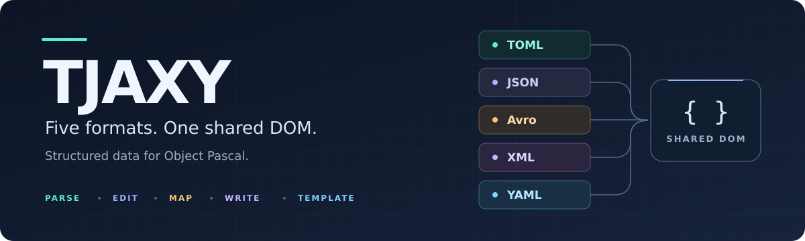

<p align="center">
  
</p>

<p align="center">
  <a href="#compiler-support"></a>
  <a href="#compiler-support"></a>
  <a href="#document-templates"></a>
  <a href="#text-and-ownership"></a>
  <a href="LICENSE"></a>
</p>

<p align="center">
  <a href="#get-started">Get started</a> ·
  <a href="#examples">Examples</a> ·
  <a href="#document-templates">Templates</a> ·
  <a href="#yaml-configuration">YAML configuration</a> ·
  <a href="#object-and-record-mapping">Object mapping</a> ·
  <a href="#compiler-support">Support</a> ·
  <a href="#build-and-test">Build &amp; test</a>
</p>

# TJAXY

**Read, edit, and write TOML, JSON/JSON5, Avro, XML, and YAML with one Delphi API.**

TJAXY gives each format a codec over the same mutable document tree. Work with
objects, arrays, and scalar values through `TTJAXYParser`, then choose the codec
that fits your file or protocol. The name follows the formats: **T**OML,
**J**SON, **A**vro, **X**ML, **Y**AML.

- **Reusable document templates** — a signature TJSON feature, now shared across
  TJAXY: define typed fields once, fill values, and compose defaults, nested
  templates, and computed fields.
- **One document model** — shared nodes, path lookup, and mutation.
- **Practical configuration** — JSON5, TOML, and an opt-in YAML profile with
  configurable byte, depth, and node limits.
- **Delphi object mapping** — objects, records, nested values, explicit factories,
  and conversion diagnostics through a replaceable mapper.
- **Text and binary I/O** — UTF-8 text across codecs, plus Avro binary,
  single-object encoding, and object containers.

## Get started

Clone the repository and add its `Source` directory to your Delphi project's
unit search path:

```bash
git clone https://github.com/nalilord/TJAXY.git
```

Add `TJAXY.Core` and the codec units you use to your `uses` clause. Keep
`TJAXY.Mapper.Delphi.inc` alongside `TJAXY.Core.pas`. You can also build the
runtime package [TJAXY.dpk](Source/TJAXY.dpk); it requires the Delphi RTL.
See [compiler support](#compiler-support) for the combinations tested here.

### Your first document

This complete console program reads a value by path, adds a field, and writes
the updated JSON:

```pascal
program HelloTJAXY;

{$APPTYPE CONSOLE}

uses
  System.SysUtils,
  TJAXY.Core,
  TJAXY.JSON;

var
  Doc: TJSON;
begin
  Doc := TJSON.FromString(
    '{"name":"TJAXY","database":{"host":"localhost"}}');
  try
    Writeln(Doc.AsObject.FindValue('database.host', 'unknown'));
    Doc.AsObject.Add('enabled', True);
    Writeln(Doc.WriteToString(tjaxywmReadable));
  finally
    Doc.Free;
  end;
end.
```

For files or streams, use `FromFile` / `FromStream` and `SaveToFile` /
`SaveToStream`. The longer `CreateFromString`, `CreateFromFile`, and
`CreateFromStream` names are also available. Avro input additionally needs
an explicit schema.

## Choose a codec

| Format | Unit / class | What you can work with |
| --- | --- | --- |
| **[TOML](#read-toml-tables)** | `TJAXY.TOML` / `TTOML` | Settings, dotted keys, tables, arrays of tables, date/time values |
| **[JSON · JSON5](#read-json5)** | `TJAXY.JSON` / `TJSON` | Strict JSON, or JSON5 comments, trailing commas, and unquoted keys |
| **[Avro](#avro-with-a-schema)** | `TJAXY.Avro` / `TAvro` | Schema-driven JSON/binary data and null/deflate object containers |
| **[XML](#xml-mapping)** | `TJAXY.XML` / `TXML` | Elements, attributes, repeated children, and namespace mapping |
| **[YAML · KYAML](#yaml-configuration)** | `TJAXY.YAML` / `TYAML` | Block and flow documents, multiple documents, and bounded configuration input |

> [!TIP]
> For ordinary block YAML, pass `yeYAML` to `TYAML.FromString` / `FromFile` /
> `FromStream`. Their default is the stricter KYAML flow mode. Configuration
> factories select YAML mode and enable the configuration restrictions for you.

## Examples

The snippets below show declarations and a program body. Use `System.SysUtils`,
`TJAXY.Core`, and the codec units named in each example.

### Build a document

With `TJAXY.JSON`, create objects and arrays directly:

```pascal
var
  Doc: TJSON;
  Formats: TTJAXYArray;
begin
  Doc := TJSON.CreateObjectRoot;
  try
    Doc.AsObject.Add('name', 'TJAXY');
    Doc.AsObject.Add('enabled', True);
    Formats := Doc.AsObject.AddArray('formats');
    Formats.Add('json');
    Formats.Add('yaml');
    Writeln(Doc.WriteToString(tjaxywmCondensed));
  finally
    Doc.Free;
  end;
end;
```

```json
{"name":"TJAXY","enabled":true,"formats":["json","yaml"]}
```

The document owns its root and children; `Formats` above is a borrowed reference.
Free the document once you have finished using its nodes.

### Use one parser interface

Application code can accept `TTJAXYParser` while the caller chooses the codec.
This example uses `TJAXY.TOML`:

```pascal
procedure PrintName(Parser: TTJAXYParser);
begin
  Writeln(Parser.AsObject.GetValue('name', 'unnamed'));
end;

var
  Parser: TTJAXYParser;
begin
  Parser := TTOML.FromString('name = "TJAXY"');
  try
    PrintName(Parser);
  finally
    Parser.Free;
  end;
end;
```

Use a typed codec variable when you need options such as `TJSON.Extension`,
`TXML.NamespaceMode`, `TYAML.Encoding`, or `TAvro.ContainerCodec`.

### Copy JSON values into YAML

With `TJAXY.JSON` and `TJAXY.YAML`, `Assign` copies the shared document tree:

```pascal
var
  JSONDoc: TJSON;
  YAMLDoc: TYAML;
begin
  JSONDoc := TJSON.FromString('{"name":"TJAXY","ports":[8080,8443]}');
  try
    YAMLDoc := TYAML.Create;
    try
      YAMLDoc.Encoding := yeYAML;
      YAMLDoc.Assign(JSONDoc);
      Writeln(YAMLDoc.WriteToString(tjaxywmReadable));
    finally
      YAMLDoc.Free;
    end;
  finally
    JSONDoc.Free;
  end;
end;
```

The copy has independent ownership. Target codecs still apply their own shape
and schema rules; conversion does not preserve source comments or formatting.

### Read JSON5

Enable JSON5 explicitly with `jeJSON5` from `TJAXY.JSON`:

```pascal
var
  Doc: TJSON;
begin
  Doc := TJSON.FromString('{name: ''TJAXY'', offset: -0x10,}', jeJSON5);
  try
    Writeln(Doc.AsObject['offset'].AsInteger); // -16
  finally
    Doc.Free;
  end;
end;
```

### Read TOML tables

With `TJAXY.TOML`, table paths become ordinary object paths:

```pascal
var
  Config: TTOML;
begin
  Config := TTOML.FromString(
    'name = "TJAXY"' + sLineBreak +
    '[database]' + sLineBreak +
    'server = "db.local"');
  try
    Writeln(Config.AsObject.FindValue('database.server', 'localhost'));
  finally
    Config.Free;
  end;
end;
```

<details>
<summary><strong>Lookup helpers</strong></summary>

`GetValue` reads the current object. `FindValue` also supports recursive name
lookup and paths; `FindNode` returns the matching node instead of its value.

| Expression | Lookup |
| --- | --- |
| `GetValue('name', 'unnamed')` | Current object, with a fallback value |
| `FindValue('database.server', '')` | Nested object path |
| `FindValue('formats[0]', '')` | Array element by index |
| `FindValue('formats[]', '')` | First array match; `[*]` is also supported |
| `FindValue('id', '')` | Recursive name lookup |

Direct keys take priority. An XML attribute object named `@` supplies a
fallback, and an empty key reads `#text` when present.

</details>

## Document templates

**TJSON's reusable templates are part of the TJAXY core.** Define a document's
fields once, then fill them with new values for API responses, messages, or
configuration files. Templates build a regular DOM; the codec writers handle
escaping and output syntax. Template construction does not require RTTI.

`TTJAXY.CreateTemplate` registers a named template, and `TTJAXY.Template` retrieves
it. The familiar `TJSON.CreateTemplate` / `TJSON.Template` entry points use the
same registry, as do the other codecs' template helpers.

### Define once, fill on demand

This example needs only `TJAXY.Core`. The template name is filled automatically;
the string and boolean fields take values in declaration order:

```pascal
var
  Generated: TTJAXY;
begin
  TTJAXY.CreateTemplate('service')
    .Add('template', tjaxyttName)
    .Add('name', tjaxyttString)
    .Add('enabled', tjaxyttBoolean);

  Generated := TTJAXY.Template('service').Fill(['api', True]);
  Writeln(Generated.WriteToString(tjaxywmCondensed));
end;
```

```json
{"template":"service","name":"api","enabled":true}
```

Calling `TTJAXY.Template('service').Fill(['worker', False])` builds the next
document from the same definition. `Fill` expects one argument per ordinary or
nested field; automatic name, time, and callback fields consume no arguments.

### Compose defaults and nested templates

`Empty` builds a document from a template's defaults. Nested templates let you
reuse whole sections, and `SetValue` updates a declared field by name. Here the
generated document is copied into `TJAXY.YAML` for output:

```pascal
var
  AppTemplate: TTJAXYTemplate;
  Generated: TTJAXY;
  YAMLDoc: TYAML;
begin
  TTJAXY.CreateTemplate('server-defaults')
    .Add('host', tjaxyttString).Default(TTJAXYString.CreateFrom('localhost'))
    .Add('port', tjaxyttInteger).Default(TTJAXYInteger.CreateFrom(8080));

  AppTemplate := TTJAXY.CreateTemplate('app-defaults')
    .Add('name', tjaxyttString).Default(TTJAXYString.CreateFrom('api'))
    .Add('server', 'server-defaults');

  Generated := AppTemplate.Empty;
  if not AppTemplate.SetValue('name', 'worker') then
    raise Exception.Create('Template field or value type does not match');

  YAMLDoc := TYAML.Create;
  try
    YAMLDoc.Encoding := yeYAML;
    YAMLDoc.Assign(Generated);
    Writeln(YAMLDoc.WriteToString(tjaxywmReadable));
  finally
    YAMLDoc.Free;
  end;
end;
```

The generated tree contains `name = "worker"`, `server.host = "localhost"`, and
`server.port = 8080`. Other codecs can receive the same tree through `Assign`;
their format rules still apply, including XML's shape and Avro's schema.

| Template feature | API / behavior |
| --- | --- |
| Typed fields | `Add('name', tjaxyttString)`; scalar, object, and array field types |
| Default values | `Default(Node)` applies to the last added field; `Empty()` uses defaults, `Empty(False)` skips this template's own defaults |
| Nested structures | `Add('server', 'server-defaults')` or `Add('server', NestedTemplate)`; `Empty()` builds the nested defaults |
| Automatic fields | `tjaxyttName` inserts the template name; `tjaxyttUnixTime` inserts the current Unix timestamp |
| Computed fields | `Add('field', Callback)` supplies a node during `Fill` |
| Named updates | `SetValue('name', Value)` returns `False` for an unknown field or a mismatched scalar type |

Defaults are used by `Empty`; `Fill` supplies its own values. `Fill` copies
document or node arguments, so the caller retains ownership of those inputs.

<details>
<summary><strong>Compute a field with a callback</strong></summary>

A callback receives the template and field names and supplies a node whose
ownership passes to the generated document. This standalone template uses
`TJAXY.Core`:

```pascal
type
  TTemplateValues = class
  public
    procedure FillSource(ATemplateName, AKeyName: String;
      var AValue: TTJAXYValue);
  end;

procedure TTemplateValues.FillSource(ATemplateName, AKeyName: String;
  var AValue: TTJAXYValue);
begin
  AValue := TTJAXYString.CreateFrom(ATemplateName + ':' + AKeyName);
end;

var
  Values: TTemplateValues;
  MessageTemplate: TTJAXYTemplate;
begin
  Values := TTemplateValues.Create;
  try
    MessageTemplate := TTJAXYTemplate.Create('event');
    try
      MessageTemplate.Add('source', Values.FillSource);
      Writeln(MessageTemplate.Fill([]).WriteToString(tjaxywmCondensed));
    finally
      MessageTemplate.Free;
    end;
  finally
    Values.Free;
  end;
end;
```

```json
{"source":"event:source"}
```

</details>

**Ownership and reuse:** the registry owns templates created through
`CreateTemplate`. A template owns default nodes passed to `Default` and the
document returned by `Fill` or `Empty`; do not free those borrowed results.
Each call rebuilds that document. Copy it with `Assign` before the next fill
when you need to retain a result. Keep callback objects alive while their
template can invoke them. For independent lifetime or concurrent generation,
create a separate `TTJAXYTemplate` per owner/worker and free it yourself;
registered templates share mutable state.

## YAML configuration

Use the configuration factories for settings files that need explicit limits.
For example, save this as `settings.yaml`:

```yaml
name: TJAXY
server:
  host: localhost
  port: 8080
```

Load it with `TJAXY.YAML` and adjust the per-instance options as needed:

```pascal
var
  Options: TYAMLConfigurationOptions;
  Config: TYAML;
begin
  Options := TYAML.DefaultConfigurationOptions;
  Options.MaxInputBytes := 512 * 1024;
  Config := TYAML.FromConfigurationFile('settings.yaml', Options);
  try
    Writeln(Config.AsObject.FindValue('server.host', 'localhost'));
  finally
    Config.Free;
  end;
end;
```

`FromConfigurationString` and `FromConfigurationStream` accept the same options.
Stream loading starts at the current position and supports non-seekable streams.

| Option | Default | What it counts |
| --- | --- | --- |
| `MaxInputBytes` | **256 KiB** (`256 * 1024`) | Raw UTF-8 input, including comments, whitespace, and a leading BOM |
| `MaxDepth` | **32** | Root at depth 1; mapping keys/values and sequence elements one level deeper |
| `MaxNodes` | **10,000** | Each key, scalar, container, and implicit null |

The former literal `262144` is the 256 KiB input default. It is an application
limit on bytes, not a character count or a peak memory guarantee. Limits must
be positive; `MaxInputBytes` must also be less than `MaxInt` to allow one extra
byte for overflow detection. There is no unlimited profile setting.

The profile rejects malformed UTF-8, NUL, multiple documents, duplicate or
complex keys, merge keys, anchors, aliases, tags, and directives. Ordinary
`TYAML.FromString` / `FromFile` calls do not enable these restrictions.

## Object and record mapping

On Delphi, map objects with `CreateFromObject` / `AssignToObject` and records
with `CreateFromRecord<T>` / `AssignToRecord<T>`. This `TJAXY.JSON` example
explicitly enables RTTI for public record fields:

```pascal
{$RTTI EXPLICIT METHODS([]) PROPERTIES([vcPublic]) FIELDS([vcPublic])}

type
  TAppSettings = record
  public
    Name: String;
    Port: Integer;
  end;

var
  Config: TAppSettings;
  Doc: TJSON;
begin
  Doc := TJSON.FromString('{"Name":"TJAXY","Port":8080}');
  try
    Doc.AssignToRecord<TAppSettings>(Config);
    Writeln(Config.Name, ' on port ', Config.Port);
  finally
    Doc.Free;
  end;
end;
```

Mapping uses the shared Core API. `ITJAXYObjectMapper` supplies the backend, and
`TTJAXYDocument.MapperCapabilities` reports its object, record, and factory
support. Delphi has a default RTTI mapper; FPC applications can register a
mapper for their supported types. See the
[FPC example](Tests/TJAXY.FPC.Smoke.pas) for an object-only implementation.

<details>
<summary><strong>Factories, ownership, and failure behavior</strong></summary>

When mapping a nested class into a nil reference, first register a factory for
the declared class with `TTJAXYDocument.RegisterObjectFactory`. Existing non-nil
objects are updated in place. `UnregisterObjectFactory` removes a registration.

A `null` value clears a class reference without freeing the old application-owned
object. Assignment stops at the first conversion or setter error; earlier writes
remain. If a setter raises, the mapper reads the property back and frees a newly
created factory object only if it was not stored. A setter whose getter also
raises must manage that uncertain ownership itself.

Fixed arrays reject excess input. Class-reference arrays are rejected during
deserialization until an application mapper supplies construction and cleanup
rules. Sets of at most eight bytes use the numeric representation; larger sets
use enum-name arrays to preserve high bits. Anonymous sets without complete
RTTI raise an explicit error.

Mapping detects traversal cycles, permits repeated acyclic references, and caps
nesting at 64. Returned serialization nodes transfer to the caller; assignment
borrows source nodes and target instances. Register a mapper before concurrent
mapping starts, and do not replace it during an operation.

</details>

<details>
<summary><strong>Conversion rules, enum policies, and diagnostics</strong></summary>

Start with `TTJAXYDocument.DefaultSerializerRules`. For enum names, set
`EnumMode := tjaxjemName`, `EnumNameCase := tjaxyncLower`, and any
`EnumStripPrefixes`, such as `['ts']`.

Pass rules to `LoadFromObject(Config, Rules)` or `AssignToObject(Target, Rules)`
for one operation. Records support `CreateFromRecordWithRules<T>(Value, Rules)`
and `AssignToRecord<T>(Target, Rules)`. These operations snapshot their rules and
serialize concurrent mapping internally. `TTJAXYDocument.SerializerRules`
remains the global compatibility default.

| Target | Accepted values / failure behavior |
| --- | --- |
| Integer | Integral numbers or decimal strings; overflow and fractions raise |
| Float | Numbers or invariant-decimal strings; `Single`, `Comp`, and `Currency` validate their conversion bounds |
| Boolean | Booleans, integer zero/nonzero, or `true` / `false` strings |
| Enum | Configured names/ordinals; unknown values raise, select the first value, or leave the member unchanged |
| String / character | Scalar values for strings; exactly one representable code unit for characters |
| Variant | Serializes as a string or null; accepts scalar or null input |

With `EnumUnknownRead := tjaxjurIgnore`, the `AssignToObject` and
`AssignToRecord` overloads taking `out Diagnostics` return
`TTJAXYMappingDiagnostic` entries with member paths. Unsupported RTTI kinds and
conversion errors raise with a member path.

Delphi reflection lives in `TJAXY.Mapper.Delphi.inc`, included inside Core's
implementation. Codecs and callers use the mapper contract without compiler
conditionals for mapping.

</details>

## XML mapping

`TJAXY.XML` maps elements into the shared tree using a few conventions:

| XML construct | DOM representation |
| --- | --- |
| Root element | Top-level object key with the root's name |
| Attributes | Object under `@` |
| Text alongside attributes or children | Value under `#text` |
| Repeated child elements | Array under the element name |

Lookup helpers handle attribute and text fallbacks:

```pascal
var
  Doc: TXML;
  Catalog: TTJAXYObject;
begin
  Doc := TXML.FromString(
    '<catalog version="1">' +
    '<item id="a">First</item><item id="b">Second</item>' +
    '</catalog>');
  try
    Catalog := Doc.AsObject['catalog'].AsObject;
    Writeln(Catalog.GetValue('version', ''));     // 1
    Writeln(Catalog.FindValue('item[0].id', '')); // a
    Writeln(Catalog.FindValue('item[0]', ''));    // First
  finally
    Doc.Free;
  end;
end;
```

Namespace prefixes are preserved by default. Pass `xnmStripPrefixes` as the
second factory argument to use local names and omit `xmlns` declarations.
Opening and closing qualified names are still validated before normalization.

## Avro with a schema

`TJAXY.Avro` takes an explicit schema and exposes decoded values through the
same DOM:

```pascal
const
  Schema =
    '{"type":"record","name":"Message","fields":[' +
    '{"name":"id","type":"long"},' +
    '{"name":"title","type":"string"},' +
    '{"name":"note","type":["null","string"],"default":null}]}';
  Value = '{"id":7,"title":"hello","note":{"string":"optional"}}';
var
  Doc: TAvro;
begin
  Doc := TAvro.FromString(Value, Schema);
  try
    Writeln(Doc.AsObject['title'].AsString);
    Writeln(Doc.AsObject['note'].AsString); // optional, without a union wrapper
    Writeln(Doc.WriteToString(tjaxywmCondensed));
  finally
    Doc.Free;
  end;
end;
```

Avro JSON unions use wrappers on input/output; the DOM exposes the selected
value directly. Schemas are parsed through `TJAXY.JSON`.
`CreateFromSchemaJSON` accepts an existing parsed JSON schema document.

| Encoding | Write | Read |
| --- | --- | --- |
| Binary payload | `WriteToBinaryBytes` | `LoadFromBinaryBytes` |
| Single-object encoding | `WriteSingleObjectBytes` | `LoadSingleObjectBytes` |
| Object container | `SaveContainerToStream` | `LoadContainerFromStream` |

Set `ContainerCodec := 'deflate'` for raw RFC 1951 compression; the default is
`'null'`. Container readers cap total records at **1,000,000**, including records
that consume zero bytes. Set `MaxContainerRecords` before loading to lower it.

## Text and ownership

Text stream/file readers validate UTF-8, accept one leading BOM, and reject
malformed byte sequences and NUL. Writers emit BOM-free UTF-8. Delphi `String`
overloads use Unicode; unpaired UTF-16 surrogates are rejected when writing.
On the tested FPC Linux target, `String` overloads expect UTF-8 in the process
code page; stream/file loaders validate the bytes explicitly.

Documents own their roots and children. Keep borrowed node references within
the lifetime of the owning tree. `Assign` copies a document; object mapping
follows the separate ownership rules described above.

<details>
<summary><strong>Migration notes</strong></summary>

- YAML native names such as `TYAMLValue` and `TYAMLObject` now alias the Core
  node types. Typed `TYAML` and generic `TTJAXYParser` references observe the same
  edits. Code relying on the former distinct hierarchy or exact exception types
  may need updating.
- Large sets serialize as enum-name arrays. Sets of at most eight bytes retain
  their numeric representation.
- Older TJAXY Avro containers using a zlib wrapper require conversion or
  regeneration. The reader now requires the raw-deflate wire format.

</details>

## Compiler support

| Compiler | Target | Tested scope |
| --- | --- | --- |
| **Delphi 37.0** | Windows, Win32 & Win64 | All five codecs, shared DOM, RTTI mapping, interoperability and heap regressions |
| **FPC 3.2.2** | Linux x86-64, `-Mdelphi` | Core, JSON, YAML configuration, and a registered object-only mapper |

FPC has no default reflection mapper: unsupported object/record operations
raise explicitly. The other codecs have not been validated on FPC.

<details>
<summary><strong>Codec coverage and known limits</strong></summary>

| Codec | Additional coverage | Current limits |
| --- | --- | --- |
| TOML | Quoted/dotted keys, inline tables, nested arrays of tables, multiline strings, decimal/hex/octal/binary integers, floats, booleans, date/time values, comments | Full TOML 1.1 edge-case coverage is not established |
| JSON / JSON5 | Strict token grammar, escaped strings, signed JSON5 hexadecimal values | No streaming SAX-style interface |
| Avro | Records, enums, arrays, maps, unions, named references, aliases metadata, primitives/defaults, multi-block reads, canonical form, CRC-64-AVRO fingerprints, date/time/uuid/decimal logical values | No snappy/zstandard; no arbitrary-precision decimal or complete schema-resolution matrix; named references must already be defined |
| XML | CDATA, entity decoding, internal DOCTYPE declaration skipping, namespace modes | No DTD validation/entity expansion or processing-instruction round-trip; external entities, non-UTF-8, and supplementary-character/name-range cases are outside the tested conformance slice |
| YAML | Block/flow syntax, anchors, aliases, merge keys, multi-document read/write | Full YAML 1.2 semantic conformance is not established; empty/comment-only input yields one null document |

The pinned YAML suite passes **402/402 acceptance cases** and **45/45 basic
semantic cases** on Win32/Win64. The unrestricted run still has **76 semantic
differences** and **5 empty-stream document-count differences**. The supported
W3C XML slice passes **288/288**, with 425 cases outside that scope. These are
recorded test results, not a claim of full format conformance; see
[test scope and reproduction instructions](Tests/README.md).

</details>

## Build and test

From WSL with a Windows Delphi compiler available:

```bash
# Build the runtime package.
./build-wsl-generic.sh Source/TJAXY.dpk Win64

# Run the full local gate for either Delphi target.
./run-tests-wsl.sh Win64
./run-tests-wsl.sh Win32
```

The test gate also needs Python 3.11+ and PyYAML for independent text readers.
It covers the codecs, mapping, heap smokes, UTF-8 output, and Avro raw-deflate
interoperability. External YAML/XML fixtures are optional: set `YAML_SUITE_DIR`
and `XML_SUITE_DIR` to their extracted directories to include them.

See [Tests/README.md](Tests/README.md) for dependencies, pinned fixture setup,
FPC commands, and the exact conformance scope. Compiler paths and other build
overrides are documented at the top of [build-wsl-generic.sh](build-wsl-generic.sh).

## Contributing

Bug reports are most useful with a small input, the expected result, the actual
result or exception, and your compiler/target. Include a focused regression
with code changes and run the relevant tests. Open an
[issue](https://github.com/nalilord/TJAXY/issues) or a
[pull request](https://github.com/nalilord/TJAXY/pulls).

## License

[BSD 2-Clause](LICENSE) · Copyright © 2026 NaliLord.
